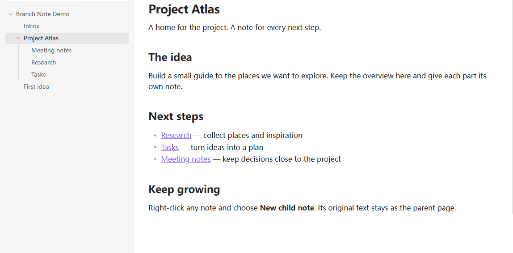

  

<h1 align="center">Branch Note</h1>

<strong>让一篇笔记，自然长出子笔记。</strong>

把笔记变成父级页面，用普通目录收纳它的子笔记。

  <a href="README.md">English</a> · 简体中文 
  <a href="#功能">功能</a> · <a href="#开始使用">开始使用</a> · <a href="#安装">安装</a> · <a href="https://github.com/elfmedy/branch-note/issues">反馈</a>

*点目录名称，回到首页；点左侧箭头，查看子笔记。*

## 功能

- **从一篇笔记，继续展开。** 右键选择**新建子笔记**，普通笔记就成为父级页面，原有内容完整保留。
- **让目录也有首页。** 目录内的同名 Markdown 自动成为首页；还没有首页时，点**开始书写**即可创建并编辑。
- **文件列表，保持简洁。** 首页融入目录条目，不重复显示；只有存在其他子条目时，才显示展开箭头。
- **沿用熟悉的编辑方式。** 使用 Obsidian 原生 Markdown 编辑器、链接与主题，设置中只有语言一项。
- **始终是普通文件。** 笔记仍是目录里的 Markdown，目录与首页同步重命名，无须特殊格式或关联数据。

## 开始使用

1. 右键一篇 Markdown 笔记，选择**新建子笔记**。
2. 在新笔记中继续书写，原笔记会成为父级首页。
3. 点击父级名称回到首页，点击箭头展开子笔记。

已经有目录？同样可以右键添加子笔记；点击目录，再点**开始书写**，即可为它创建首页。

## 安装

打开 Obsidian 的 **设置 → 第三方插件 → 浏览**，搜索 **Branch Note**，安装并启用。后续点击**检查更新**即可。

[打开社区插件页面](https://community.obsidian.md/plugins/branch-note) · 要求 **Obsidian 1.13.7+**

BRAT 与手动安装

- **BRAT**：添加 `elfmedy/branch-note`。
- **手动安装**：从 [Releases](https://github.com/elfmedy/branch-note/releases/latest) 下载 `main.js`、`manifest.json` 和 `styles.css`，放入知识库的 `.obsidian/plugins/branch-note/` 后启用。

**删除首页**只删除首页；原生**删除**仍可删除整个目录。启用前，请停用其他接管目录首页的插件。

文件结构、重命名、撤销与恢复见[使用指南](docs/guide.zh-CN.md)；已验证的平台和插件组合见[兼容性说明](COMPATIBILITY.md)。

---

[反馈问题](https://github.com/elfmedy/branch-note/issues) · [版本更新](https://github.com/elfmedy/branch-note/releases) · [开发说明](docs/guide.md#development) · [MIT 开源许可](LICENSE)
